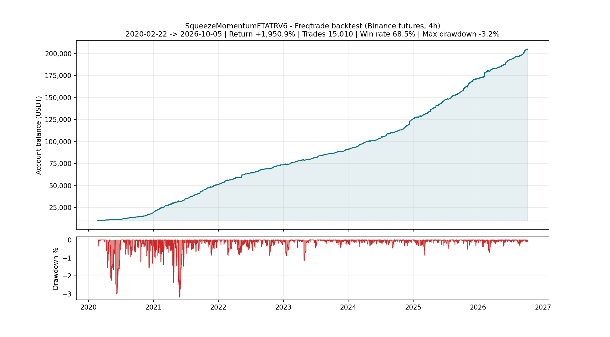
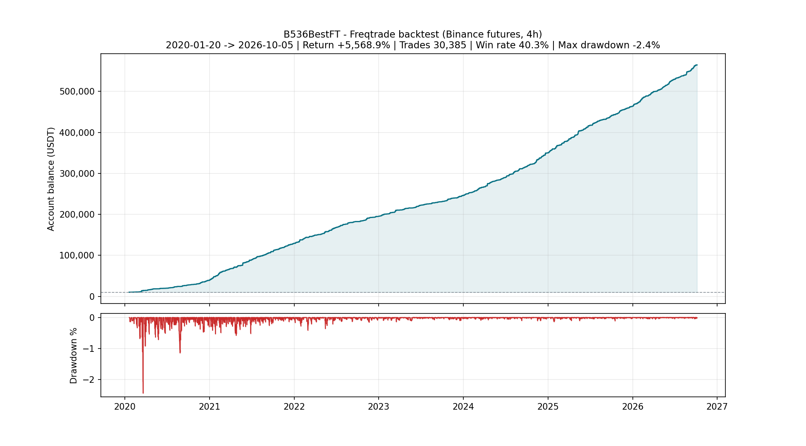
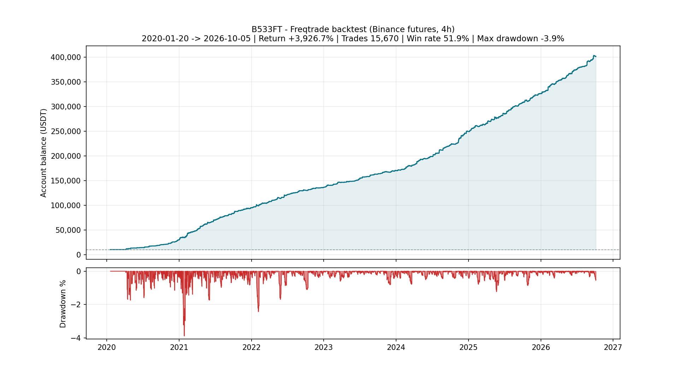
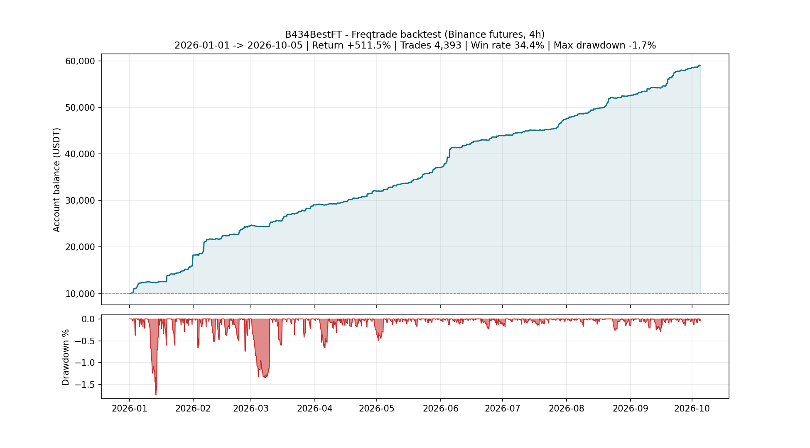

# Freqtrade Strategy Backtest Results

Equity curves, drawdown analysis, monthly returns and **complete trade-by-trade records** for my Freqtrade trading strategies on Binance futures.

> The strategy source code is proprietary and is **not** published. Everything on this page — every percentage, every drawdown — can be re-computed from the full trade logs linked under each strategy. No cherry-picked screenshots: 65,458 closed trades across the four strategy reports below, wins and losses included.

## How these results can be verified

Each strategy report contains:

- **Equity & drawdown chart** built from the backtest wallet history (mark-to-market, including open positions)
- **Full trade log (CSV)** — pair, entry/exit timestamps, entry/exit prices, side (long/short), leverage, stake, profit per trade, exit reason
- **Monthly P&L** and a **per-pair breakdown** (trades, win rate, profit)

All figures are generated from standard Freqtrade backtest exports. Source code, entry/exit logic and parameters are intentionally excluded.

## Strategy summary

| Strategy | Timeframe | Backtest period | Trades | Win rate | Return (10,000 USDT start) | Max drawdown | Profitable months |
|---|---|---|---|---|---|---|---|
| SqueezeMomentumFTATRV6 | 4h | 2020-02-22 → 2026-10-05 | 15,010 | 68.5% | **+1,950.9%** (→ 205,094 USDT) | −3.2% | 80 / 81 |
| B536BestFT | 4h | 2020-01-20 → 2026-10-05 | 30,385 | 40.3% | **+5,568.9%** (→ 566,888 USDT) | −2.4% | 82 / 82 |
| B533BestFT | 4h | 2020-01-20 → 2026-10-05 | 15,670 | 51.9% | **+3,926.7%** (→ 402,671 USDT) | −3.9% | 78 / 79 |
| B434BestFT | 4h | 2026-01-01 → 2026-10-05 | 4,393 | 34.4% | **+511.5%** (→ 61,149 USDT) | −1.7% | 10 / 10 |

*Max drawdown is measured on the backtest wallet curve (peak-to-trough, including unrealized P&L).*

## Common backtest setup

- **Framework:** Freqtrade (event-driven backtesting, no look-ahead)
- **Exchange / market:** Binance USDT-margined perpetual futures, isolated margin
- **Leverage:** 10x · **Concurrent positions:** up to 50 pairs out of a 50-pair universe
- **Starting capital:** 10,000 USDT per backtest

---

## 1. SqueezeMomentumFTATRV6

- **Period:** 2020-02-22 → 2026-10-05 (6.6 years, incl. the 2020 crash, 2021 bull market, 2022 bear market and the 2024–2026 cycles)
- **Trades:** 15,010 closed (7,659 long / 7,351 short across 50 pairs)
- **Win rate:** 68.5% · **Final balance:** 205,094 USDT (+1,950.9%)
- **Max drawdown:** −3.2% (worst single month: −3 USDT — effectively flat)
- **Profitable months:** 80 of 81 · **Best month:** +7,261 USDT

Data: [full trade log](data/squeeze_trades_public.csv) · [monthly P&L](data/squeeze_monthly.csv) · [per-pair breakdown](data/squeeze_per_pair.csv)

## 2. B536BestFT

- **Period:** 2020-01-20 → 2026-10-05 (6.7 years — crypto winter, two bull cycles, the 2022 crash)
- **Trades:** 30,385 closed (15,393 long / 14,992 short across 50 pairs)
- **Win rate:** 40.3% · **Final balance:** 566,888 USDT (**+5,568.9%**)
- **Max drawdown:** −2.4% · **Not a single losing month in 82 months** (worst month: +164 USDT)
- **Profitable months:** 82 of 82 · **Best month:** +14,867 USDT

Data: [full trade log](data/b536_trades_public.csv) · [monthly P&L](data/b536_monthly.csv) · [per-pair breakdown](data/b536_per_pair.csv)

## 3. B533BestFT

- **Period:** 2020-01-20 → 2026-10-05 (6.7 years)
- **Trades:** 15,670 closed (8,061 long / 7,609 short across 50 pairs)
- **Win rate:** 51.9% · **Final balance:** 402,671 USDT (**+3,926.7%**)
- **Max drawdown:** −3.9% · **Profitable months:** 78 of 79 (worst month: −270 USDT)
- **Best month:** +15,014 USDT

Data: [full trade log](data/b533_trades_public.csv) · [monthly P&L](data/b533_monthly.csv) · [per-pair breakdown](data/b533_per_pair.csv)

## 4. B434BestFT

- **Period:** 2026-01-01 → 2026-10-05
- **Trades:** 4,393 closed (2,157 long / 2,236 short across 49 pairs)
- **Win rate:** 34.4% — a classic trend profile: many small losses, few large winners
- **Final balance:** 61,149 USDT (+511.5%) · **Max drawdown:** −1.7%
- **Profitable months:** 10 of 10 · **Best month:** +8,273 USDT

Data: [full trade log](data/b434_trades_public.csv) · [monthly P&L](data/b434_monthly.csv) · [per-pair breakdown](data/b434_per_pair.csv)

All four strategies are documented above; new reports will be added as further strategies complete their full-history backtests.

---

## Notes & disclaimer

These are hypothetical backtest results produced by Freqtrade's backtesting engine. They include exchange fees and funding as modeled by the framework, but live trading additionally faces slippage, latency, partial fills and changing market microstructure, so real results **will** differ. Past performance does not guarantee future results. Nothing here is financial advice or a signal service.

## Work with me

I build and backtest Freqtrade strategies and crypto trading automation for clients: strategy development, robust backtesting pipelines (with full trade-log transparency like this page), portfolio/multi-pair setups, and dry-run → live deployment tooling.

📬 Reach me via my [GitHub profile](https://github.com/helloword8888889) — open an issue or discussion on any repository.
